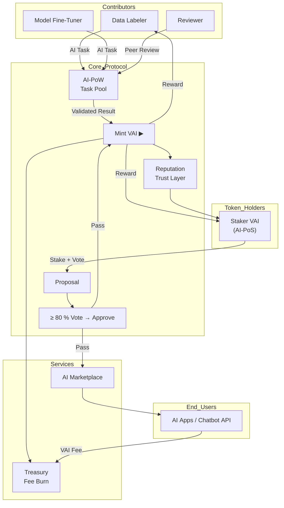

## Overview

## Introduce

## Value stream (Mermaid diagram)

```mermaid
%%{ init: { 'flowchart': { 'rankDir': 'TB', 'nodeSpacing': 20, 'rankSpacing': 40 } } }%%
flowchart TB
  %% ---------- ACTORS -------------------------------------------------
  subgraph Contributors
    U1["Data&nbsp;Labeler"]
    U2["Model&nbsp;Fine-Tuner"]
    U3["Reviewer"]
  end

  subgraph Token_Holders
    S1["Staker&nbsp;VAI<br/>(AI-PoS)"]
  end

  %% ---------- CORE ---------------------------------------------------
  subgraph Core_Protocol
    AI_PoW["AI-PoW<br/>Task&nbsp;Pool"]
    Proposal["Proposal"]
    Vote["≥&nbsp;80&nbsp;% Vote&nbsp;→&nbsp;Approve"]
    Mint["Mint&nbsp;VAI&nbsp;▶"]
    Reputation["Reputation<br/>Trust&nbsp;Layer"]
  end

  %% ---------- SERVICES & USERS --------------------------------------
  subgraph Services
    Marketplace["AI&nbsp;Marketplace"]
    Treasury["Treasury<br/>Fee&nbsp;Burn"]
  end

  subgraph End_Users
    Apps["AI&nbsp;Apps / Chatbot&nbsp;API"]
  end

  %% ---------- FLOWS --------------------------------------------------
  U1 -->|"AI&nbsp;Task"| AI_PoW
  U2 -->|"AI&nbsp;Task"| AI_PoW
  U3 -->|"Peer&nbsp;Review"| AI_PoW
  AI_PoW -->|"Validated&nbsp;Result"| Mint
  S1 -->|"Stake&nbsp;+&nbsp;Vote"| Proposal
  Proposal --> Vote
  Vote -->|"Pass"| Mint
  Vote -->|"Pass"| Marketplace
  Mint -->|"Reward"| U1
  Mint -->|"Reward"| S1
  Mint --> Treasury
  Marketplace --> Apps
  Apps -->|"VAI&nbsp;Fee"| Treasury
  Mint --> Reputation
  Reputation --> S1

```
